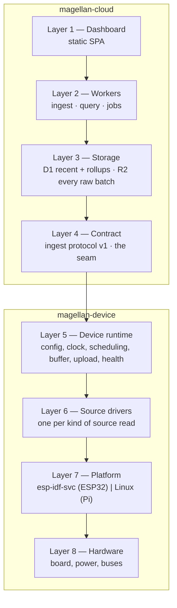
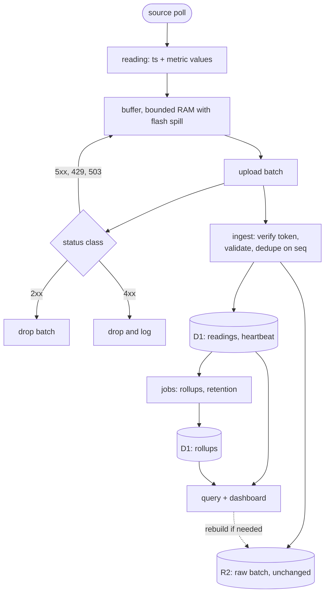

# Design

North star. What Magellan Cloud is aimed at, so a proposal, a ticket or a diff can be checked
against it.

- **Malleable until built.** Everything here is a hypothesis until code enacts it; change it freely,
  and the diff is the record. Only what the deferral exemptions below name is settled — durable
  storage shapes, published contracts, boundaries later code assumes — and that changes through an
  ADR, never a quiet edit.
- **Scope.** If deferring a decision is cheap, it does not belong here. What stays is what the
  `AGENTS.md` deferral exemptions cover, plus the invariants those protect.
- **Present tense.** Stated as fact, including where no code enacts it yet.
- **On contradiction.** This document or the thing disagreeing with it is wrong. Decide which, then
  change that one — before code enacts a shape this document leads; after, the built shape leads and
  this catches up.
- **Concise.** Under 200 lines outside the diagrams. Guidance, not a check.

Vocabulary is `docs/CONTEXT.md`.

## 1. Purpose

Magellan collects readings from small devices — a solar inverter read over Modbus today, a current
clamp tomorrow — and stores them so they can be charted and queried later.

The device is where the variety lives; the cloud is deliberately dull. A device describes its own
sources and metrics in a manifest, and the cloud stores whatever the manifest declares. **The cloud
never learns a device-specific word.** It knows `source`, `metric`, `reading`, `manifest` — never
"inverter". A new kind of source is a device-side change, not a deploy.

**No reading is lost.** Wi-Fi drops, the cloud is briefly down, the power cuts. These are the normal
case, not failures: the device buffers, retries, and the cloud absorbs the duplicate that inevitably
follows. Delivery is at-least-once; commitment is idempotent.

## 2. Constraints

A decision violating one is wrong.

**Cost is a hard budget, not a target.** The platform runs at no marginal cost, and the binding
limit is D1 rows written per day; every shape below is chosen to stay inside it. The quotas
themselves are the maintainer's, not this document's.

**Two repositories, one seam.** The cloud and the device halves are built, tested and deployed
independently. They meet only at the contract (Layer 4); nothing else crosses. This repository
publishes the contract document and `magellan-device` reads and transcribes it, each side keeping
its own parser — no shared code, no CI joining the pair.

**No data loss across the seam.** Outage handling is a property of the contract: **2xx** means
committed and the device may drop the batch · **4xx** means rejected, the device drops and logs,
except a rejected credential, which keeps the buffer · **5xx or network** means the device retries
with backoff. A batch the cloud refuses to commit is a batch the device still holds.

**Only the archive and the contract are durable.** R2 holds every raw batch and every manifest
unchanged, and the contract is what the other repository reads. D1 is a derived index over the
archive and can be rebuilt from it, so its columns are engineering, not this document.

## 3. Layers

Numbered and named. This repository owns Layers 1–4; `magellan-device` owns Layers 5–8.



## 4. What it is, and isn't

- **A generic collector.** The cloud is device- and source-agnostic by construction: manifests
  declare the shape, and the dashboard renders charts from metric descriptors rather than from
  hardcoded fields.
- **Effectively-once, never exactly-once.** Exactly-once does not exist end to end. At-least-once
  delivery plus idempotent commitment is what is built.
- **One deployable per worker**, separate for cost and blast radius, not for autonomy. One D1
  database, one R2 bucket, shared.
- **Not a time-series database.** D1 holds recent readings and rollups; R2 holds the archive. It is
  not queried for long-range analytics.
- **No device commands.** The contract runs one way — device to cloud. Control, configuration and
  OTA are out of scope until a manifest round-trip needs them.
- **No vendor knowledge in the cloud.** If a table, column or chart mentions a device model, the
  boundary has leaked.
- **No org hierarchy yet.** `sites > plants > devices` is real and deferred: a registry level above
  devices, cloud-side only. It crosses no seam — a device is re-parented by a registry row, and
  neither its path nor its environment changes. Deferring costs a registry migration when it lands,
  not a wire change.

## 5. Invariants

1. **The cloud stores what the manifest declares, sight unseen.** A metric key the cloud has never
   heard of is stored, not rejected, provided the manifest declares it.
2. **A manifest is versioned by hash.** The device sends its manifest on boot and whenever its
   sources change; the hash is the identity. A batch names the manifest it was read under.
3. **A reading is one source poll** — a timestamp plus that source's metric values. It is not one
   row per metric.
4. **Delivery duplicates are absorbed; distinct readings are kept.** Duplicate `(device_id, seq)` is
   a no-op returning success. `seq` is a presence check, never a ratchet — a batch below the highest
   `seq` seen still commits, so a device that lost its counter is not silenced. Two readings that
   genuinely share a timestamp collide on the key and the second is dropped, not mistaken for a
   retry.
5. **Commit is atomic per batch.** Either every reading in a batch lands and its `seq` is recorded,
   or nothing does and the device retries the whole batch.
6. **Values are integers, scaled on the device; timestamps are UTC.** A metric declares a decimal
   exponent and a reading carries whole numbers: the physical value is `value × 10^exponent`. The
   cloud stores integers and instants — never a float, never engineering units in flux, never local
   time.
7. **Every raw batch is archived unchanged.** R2 holds the batch exactly as sent. D1 is a derived
   index over that archive and can be rebuilt from it.
8. **One revocable token per device.** A token identifies exactly one device and can be rotated or
   revoked without touching another.
9. **The contract is the only interface.** There is no shared code, no shared database, no shared
   deployment between the repositories.
10. **Cost is bounded.** A shape that cannot fit the budget is wrong, not a budget to raise.

## 6. Contract (Layer 4)

This section is orientation. The contract's source of truth is `packages/contract/`: Zod schemas the
cloud parses with. The document the device reads is an OpenAPI description derived from them once
the endpoints exist — never authored twice. Rust types are written natively rather than generated,
so the two implementations stay independent of each other's toolchain while agreeing on the emitted
shape (`docs/adr/0001-contract-authoring.md`).

Until the first `contract-v*` tag the contract is provisional: no version is published, so the seam
is cheap to move. What the tag freezes — the wire bytes — and what D1 or R2 persist are settled
before it; the wire _around_ the bytes settles when the endpoints are built, against a running
worker rather than on paper. After the tag, a breaking change is a new version, not an edit.

```
PUT  /v1/devices/{id}/manifest
POST /v1/devices/{id}/batches
```

**Manifest** — the device's sources and their metrics, with `kind` (`gauge`, `counter`, `state`) and
a `unit` and an `exponent` for anything measured — a state has neither, its value being a code. The
exponent is the metric's, so re-scaling one is a new manifest (`docs/adr/0002-integer-values.md`).
The hash is SHA-256 over the manifest's bytes as sent; the cloud recomputes it from the body it
receives and answers the PUT with the accepted hash in `ETag`, so the device asserts its own matches
rather than trusting it.

**Batch** — `manifest_hash`, `seq`, an ordered `readings[]`, and an optional `heartbeat` carrying a
boot id, uptime, buffer depth, battery, signal and firmware version. `seq` is a lifetime counter,
monotonic per device and sent as a decimal string, canonical and at most u64::MAX; it is what the
cloud deduplicates on, and what makes "was this delivered" answerable without a batches table. A
reading's values are integers, each scaled by its metric's `exponent`.

A rule the document cannot state — unique source ids, unique metric keys — stays enforced cloud-side
and travels in the emitted document as description text, so the device author reads the rule rather
than inferring it. A rule it can state rides as a keyword the device asserts.

Responses are policy, not documentation: a device reads the status class and acts.

| Class            | Meaning                          | Device does                      |
| ---------------- | -------------------------------- | -------------------------------- |
| 2xx              | committed (or already present)   | drop the batch                   |
| 4xx              | rejected, will never succeed     | drop and log                     |
| 401              | credential rejected              | keep buffer, retry with backoff  |
| 403              | path `{id}` disagrees with token | keep buffer, retry with backoff  |
| 429 / 503        | cloud cannot commit now          | retry with backoff, keep buffer  |
| 5xx, no response | unknown state                    | retry; the duplicate is absorbed |

A rejected credential is the one 4xx the cloud causes and the maintainer fixes, so dropping a buffer
on it loses readings nothing recovers. A device stuck there is a health signal, not a lost device.

An unknown `manifest_hash` is not the device's fault — the contract has it send its manifest before
a batch that names it — so the cloud archives the batch, answers `5xx`, and the archive rebuilds D1
once the manifest is present.

## 7. Cloud (Layers 1–3)

- **ingest-worker** — device-facing. Verifies the token, validates against the contract, stores the
  manifest, commits readings, writes the raw batch to R2.
- **query-worker** — dashboard-facing, behind Cloudflare Access. Device list, health, and
  time-series queries over D1.
- **jobs-worker** — cron. Hourly and daily rollups, D1 retention, silent-device detection.
- **dashboard** — static SPA. Renders charts generically from metric descriptors.
- **D1** — the registry (devices, manifests, metrics), recent readings, heartbeats, rollups.
- **R2** — every raw batch and every manifest, unchanged. The archive D1 can be rebuilt from.

Readings are one row per poll, with the minimum indexes the queries need — indexes cost writes on
the same budget. Rollups collapse many readings into one row per bucket per metric, so the long tail
is cheap to chart. When D1 cannot commit, ingest archives to R2 and returns "retry later"; the
device keeps its buffer and the archive rebuilds D1 afterwards.

A device token is minted by the cloud, returned once, and stored only as its SHA-256 hash; a device
sends it as `Authorization: Bearer`.

## 8. Device (Layers 5–8)

What the cloud assumes of the other repository, and no more — how the device is built is
`magellan-device`'s design.

- The device buffers readings across outages, bounded on purpose: when the buffer fills, the oldest
  batch is dropped and `seq` leaves a visible gap rather than the device dying. A gap is recoverable
  from nothing, so `jobs-worker` reports it as a health signal, never hides it.
- It computes the manifest hash itself, and sends its manifest on boot and whenever sources change.
- It sends a heartbeat with the batch, and its own account of uptime, buffer depth and firmware.
- It issues no request the contract does not define.

## 9. The path of a reading



The device's buffer is the only thing standing between a poor connection and a hole in the record.
